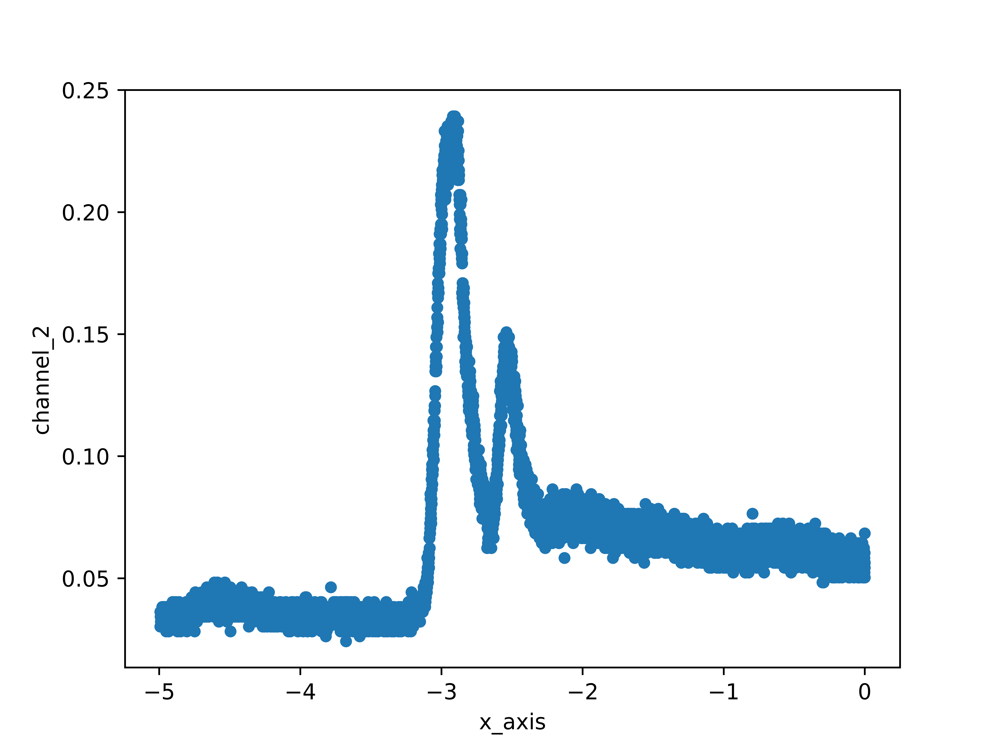
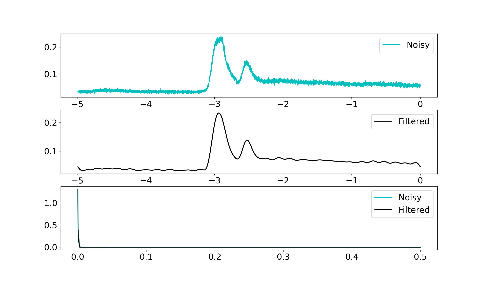

# Smart Wearable Tech Software

**🐍 Chunder's Crew 🐍**

## Contents

1. Aims
2. Overview
3. Data Acquisiton
4. Data Cleaning
5. Data Analysis
6. Database
7. Functions list

## 0. Change Log

- 09/06 Added General overview of the project
- 13/06 Fast Fourier Transform information added, csv files moved to `data` directory with subdirectories corresponding to which set the data came from, support for importing added
- 14/06 Added material from 21T2 Project Plan

## 1. Aims:

- The sensor and software package will be designed to analyse vocalisations of the NATO phonetic alphabet, rather than the entirely of the English language.

## 2. Overview

- Our team was tasked with the creation of a smart wearable sensor which converts throat vibrations into sound. Term 1 was largely dominated by research and laboratory work which, despite a delayed start, yielded promising sensor responses to both mechanical and vocal vibrations. Nonetheless, when subjected to controlled vibrations, the sensor produced increasingly noisy output at high frequencies (>100 Hz), resulting in a deteriorated signal-to-noise ratio (SNR) and data which was difficult to analyse.

- In 21T2, the team will be obtaining different types of sensors (piezoresistive, piezoelectric, capacitive) to assess their sensitivity, the effect of varying frequencies on the SNR, and power consumption. Currently, a Pt coated PDMS Piezoresistive Sensor shows promise in laboratory tests as it produces larger signals, implying it is more sensitive than previous sensors. However, increases sensitivity consequently leads to amplified noise produced by breathing, head movements and swallowing. Research is being conducted into utilizing software to apply a Fast Fourier Transform to denoise these signals, and preliminary work is generating denoised data for more detailed analysis.

- The aforementioned software has been implemented with Python, which has been chosen over MATLAB for its greater flexibility and familiarity. Python will be used to denoise signals and construct a comparative analysis algorithm to compare incoming sensor signals with a calibrated databank of select words.

- The team will now design tests to determine the optimal sensor placement for ample sensitivity and comfort, with repetitions for each type of sensor provided. Software development will focus on removing noise produced by breathing, head movements and swallowing, and research into comparative analysis techniques.

## 3. Data Acquisiton

### 3.1 Matplotlib Library in Python

- Matplotlib is a useful library for plotting graphs.
- To graph something in Python using Matplotlib, there are two lines of code we need:
- The first line is,

  ```python
    matplotlib.pyplot.plot(<x axis data>, <y axis data>)
  ```

- The second line is,

  ```python
    matplotlib.pyplot.show()
  ```

- Since it can be annoying to type out 'matplotlib.pyplot' every time we want to call something from the library we can simply state at the top:

  ```python
    from matplotlib import pyplot as plt
  ```

- This means that we can simply write 'plt' wherever we had 'matplotlib.pyplot'

  ```python
      plt.plot(<x axis data>, <y axis data>)
      plt.show()
  ```

- Now if we run the code using our normal command 'python3 <filename>.py', we should have a new window pop up with the graph.

  - Keep in mind the default graph type for matplotlib is a line graph. If we want another type of graph we will have to specify its type as follows:

  ```python
      plt.plot(kind='<graph type>', x='<x axis data>', y='<y axis data>')
  ```

#### 3.1.1 Known issues with Matplotlib and WSL (Windows Subsystem for Linux)

- There appears to be an issue with Matplotlib and WSL. More specifically, it seems to have issues with:

  ```python
      matplotlib.pyplot.show()
  ```

- Our initial workaround in `scatter.py` is to instead save a PNG of the plot in the same directory as `scatter.py` and open it. It has since been discovered that executing the Python code in a Jupyter notebook allows for dynamic production of figures in VSCode.

### 3.2 Visualising Data Acquired from CSV files

#### 3.2.1 Formatting the CSV files

- We need to format the CSV files in such a way matplotlib will be able to plot.

##### Original Format of CSV files from oscilloscope

```csv
    x-axis,2,4
    Volt,second,second
    -4.9921875E+00,+36.2374E-03,-0.0E+00
    -4.9914063E+00,+30.2073E-03,-804.0E-06
    -4.9906250E+00,+30.2073E-03,-804.0E-06
    -4.9898438E+00,+34.2274E-03,-1.6080E-03
    -4.9890625E+00,+34.2274E-03,-804.0E-06
    ...
```

##### Modified Format of CSV files from oscilloscope

```csv
    x_axis,channel_2,channel_4
    -4.9921875,0.03624,0.0
    -4.9914063,0.03021,-0.0
    -4.990625,0.03021,-0.0
    -4.9898438,0.03423,-0.002
    -4.9890625,0.03423,-0.0
    ...
```

#### 3.2.1 Plotting the Data from the CSV Files

- There exists a file `plot.py` in **src** which contains several functions for plotting both raw csv data, cleaned csv data, and their Fast Fourier Transform (FFT).

  ```python
      scope_num = 0
      lab_num = 1
      data = f'data/Lab_{lab_num}/scope_{scope_num}.csv' # path to the csv file to be plotted
  ```

  By changing the values of 'scope_num' and 'lab_num', specific csv files can be accessed and coresponding plots can be generated within a Jupyter notebook.
  This will also save a high-quality png into the same directory as the 'scatter.py' file. This plot is generated \
  from the matplotlib library and looks like the plot below



A line graph version of the same data can be seen below:


## 4. Data Cleaning

blah blah can do later, copy from Project Plan

### 4.1 Fast Fourier Transform (FFT)

- In layman's terms, the Fourier Transform is a mathematical operation that changes the domain (x-axis) of a signal from time to frequency

- Fast Fourier Transforms are a way to clean up our data and reduce the amount of noise present in out plots.

- The maths involved in an FFT is quie complex, and is left as an exercise to the reader

#### 4.1.1 Implementing FFT using Python

- Located in `src` is a file called `fft_example.py`. This file takes any of the csv files obtained from the labs and outputs a plot of the original function, its FFT and an inverse FFT with reduced noise. An example is shown below.



- However, it is in fact much easier to use the file `fft.ipynb` located in the `smart_wearable_tech` directory. This is a Jupyter Notebook, allowing for the division of code into small cells which can be individually run and debugged accordingly.

## 5. Data Analysis

blah blah can do later, copy from Project Plan

## 6. Database

### 6.1 Establishing a Word Bank

- At the commencement of this project, the team aimed to deliver a package which would detect and analyse any vocal vibrations, and consequently produce a corresponding text output.

- This scope has since been reduced due to the complex and irregular nature of the English lexicon; rather than documenting every phoneme of the spoken English language, we will focus on a select assortment of words. More specifically, the package will be designed to process the NATO Phonetic Alphabet.

#### 6.1.1 NATO Phonetic Alphabet (NPA)

- The NATO Phonetic Alphabet is the established phonetic alphabet for all military, civilian and amateur radio communications. It contains 26 words, substituting a unique codeword for each letter of the alphabet:

<p allign='center'>
  <em>Alfa, Bravo, Charlie, Delta, Echo, Foxtrot, Golf, Hotel, India, Juliett, Kilo, Lima, Mike, November, Oscar, Papa, Quebec, Romeo, Sierra, Tango, Uniform, Victor, Whiskey, X-Ray, Yankee, Zulu. </em>
</p>

- Each codeword in the NPA was chosen to sound distinct from each other, and incorporates sounds common to English, French, and Spanish.

- The testing team will utilise their testing setup to acquire repetitions of sensor data for each of the codewords in the NPA. This data will be handed to the software team for processing, with the accumulation of processed data establishing a unique profile for corresponding codewords.
  - Subsequently, new signals acquired by the sensor will be subjected to a probability match against the codeword profiles to determine exactly which codeword was spoken, and hence produce an appropriate speech output.

## 7. Interface Specifications

### 7.1 About

- The functions list will allow the team to have to brief understanding of what each function is supposed to do and the expected input and output values that the function must contain in order for other functions to work as they should.

### 7.2 Data types

<table>
  <tr>
    <th>Variable name</th>
    <th>Type</th>
  </tr>
  <tr>
    <td><b>filename</b></td>
    <td>string</td>
  </tr>
</table>

### 7.3 Functions

will have to do later but this is just random code on how to start a table. enjoy :)

  <table>
  <tr>
    <th>Name & Description</th>
    <th>Data Types</th>
    <th>Exceptions</th>
  </tr>
  <tr>
    <td><code>csv_format</code><br /><br />Given a CSV filename, format the CSV in a way Matplotlib can plot.</td>
    <td><b>Parameters:</b><br /><code>filename</code><br /><br /><b>Return Type:</b><br /><code>None<code></td>
    <td>
      <b>InputError</b> when any of:
      <ul>
        <li>Filename entered is not a valid file</li>
      </ul>
    </td>
  </tr>
  <tr>
  </table>

link to google doc just in case this table thing does not work out: https://docs.google.com/document/d/1SIq7Kt2bmYPdOGgqtmAKAjPw-a_mt3PVh_RuykiMsfY/edit
