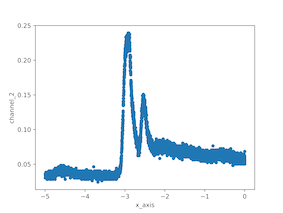

# Smart Wearable Tech Software

**🐍 Chunder's Crew 🐍**

## Contents

1. Aims
2. Overview
3. Data Acquisiton
4. Data Cleaning
5. Data Analysis
6. Database

## 0. Change Log

- 09/06 Added General overview of the project

## 1. Aims:

- Using the Data acquired from the labs, analyse the data and output a matching output to a spoken input

## 2.Overview

- blah blah can do later, copy from Project Plan

## 3. Data Acquisiton

### 3.1 Matplotlib Library in Python

- Matplotlib is a useful library for plotting graphs.
- To graph something in Python using Matplotlib, there are two lines of code we need:
- The first line is,

  ```python
    matplotlib.pyplot.plot(<x axis data>, <y axis data>)
  ```

- The second line is,

  ```python
    matplotlib.pyplot.show()
  ```

- Since it can be annoying to type out 'matplotlib.pyplot' every time we want to call something from the library we can simply state at the top:

  ```python
    from matplotlib import pyplot as plt
  ```

- This means that we can simply write 'plt' wherever we had 'matplotlib.pyplot'

  ```python
      plt.plot(<x axis data>, <y axis data>)
      plt.show()
  ```

- Now if we run the code using our normal command 'python3 <filename>.py', we should have a new window pop up with the graph.

  - Keep in mind the default graph type for matplotlib is a line graph. If we want another type of graph we will have to specify its type as follows:

  ```python
      plt.plot(kind='<graph type>', x='<x axis data>', y='<y axis data>')
  ```

#### 3.1.1 Known issues with Matplotlib and WSL (Windows Subsystem for Linux)

- There appears to be an issue with Matplotlib and WSL. More specifically, it seems to have issues with:

  ```python
      matplotlib.pyplot.show()
  ```

- Our workaround in `scatter.py` is to instead save a PNG of the plot in the same directory as `scatter.py` and open it.

### 3.2 Visualising Data Acquired from CSV files

#### 3.2.1 Formatting the CSV files

- We need to format the CSV files in such a way matplotlib will be able to plot.

##### Original Format of CSV files from oscilloscope

```csv
    x-axis,2,4
    Volt,second,second
    -4.9921875E+00,+36.2374E-03,-0.0E+00
    -4.9914063E+00,+30.2073E-03,-804.0E-06
    -4.9906250E+00,+30.2073E-03,-804.0E-06
    -4.9898438E+00,+34.2274E-03,-1.6080E-03
    -4.9890625E+00,+34.2274E-03,-804.0E-06
    ...
```

##### Modified Format of CSV files from oscilloscope

```csv
    x_axis,channel_2,channel_4
    -4.9921875,0.03624,0.0
    -4.9914063,0.03021,-0.0
    -4.990625,0.03021,-0.0
    -4.9898438,0.03423,-0.002
    -4.9890625,0.03423,-0.0
    ...
```

#### 3.2.1 Plotting the Data from the CSV Files

- There exists a file `scatter.py` in **src** which will take a CSV file and output a plot of the data.

  ```python
      filename = 'scope_0.csv' # CSV file to be plotted
  ```

  This will also save a high-quality png into the same directory as the 'scatter.py' file. This plot is generated \
  from the matplotlib library and looks like the plot below



### 3.3 Fast Fourier Transform (FFT)

- Add any research on what FFT's are, why they are useful and how to implement them using python.

```python
      # Insert Python code for FFT's
```

## 4. Data Cleaning

blah blah can do later, copy from Project Plan

## 5. Data Analysis

blah blah can do later, copy from Project Plan

## 6. Database

blah blah will be a future thing
